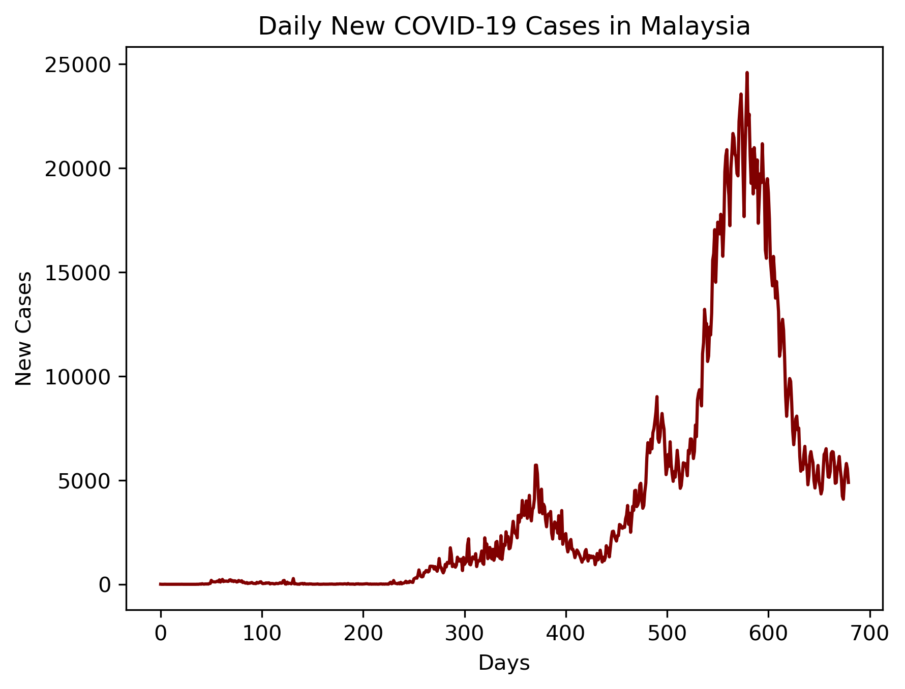
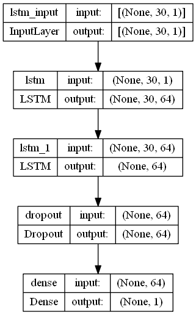
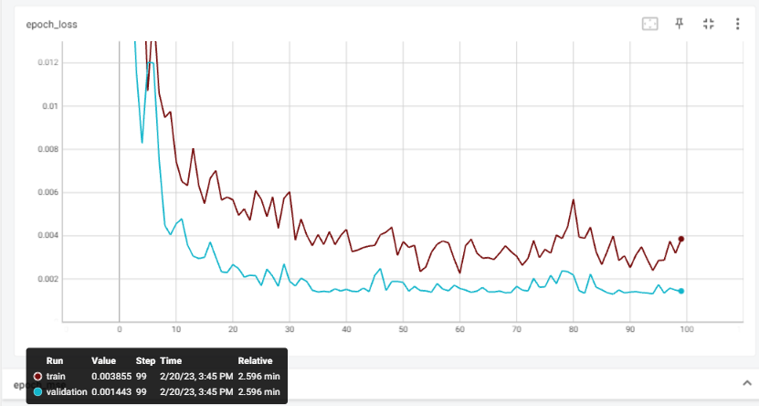
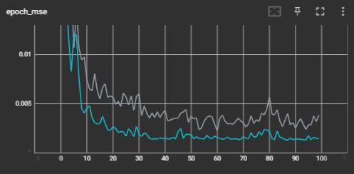
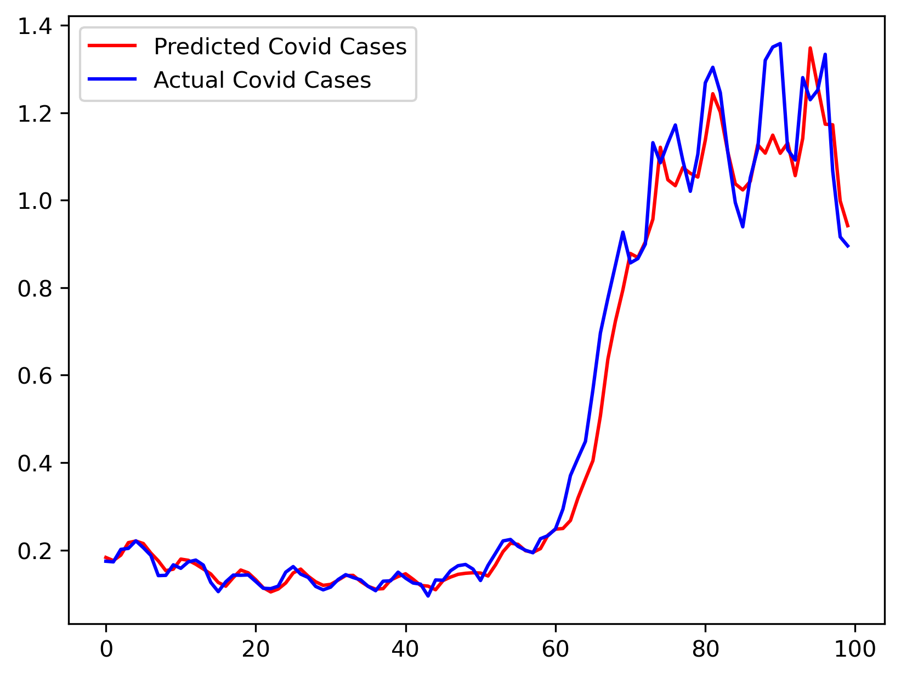
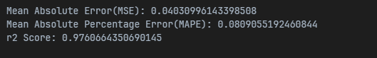

# Covid-19 Daily Cases Prediction in Malaysia

The COVID-19 pandemic has been a major public health crisis in Malaysia, with thousands of new cases reported every day. This project aims to use deep learning models to predict the number of new COVID-19 cases in Malaysia. The daily cases data are obtained from the [Ministry of Health Malaysia's GitHub Repo](https://github.com/MoH-Malaysia/covid19-public), which provides up-to-date data on the number of new COVID-19 cases in Malaysia.

## Build With

  
  
  
  
  
  
  

## Directory Structure

1. [datasets](https://github.com/M-ImranIsmael/Deep_Learning_Applications/tree/master/covid_cases_prediction/datasets):

   - cases_malaysia_train.csv: for model training
   - cases_malaysia_test.cs: for model testing

2. [training.py](https://github.com/M-ImranIsmael/Deep_Learning_Applications/blob/master/covid_cases_prediction/imran_training.py):

   - Importing necessary libraries
   - Loading, EDA, and data cleaning
   - Model selection and training using LSTM model
   - Model saving and testing on new datasets

3. [model_and_pickle](https://github.com/M-ImranIsmael/Deep_Learning_Applications/tree/master/covid_cases_prediction/model_and_pickle): trained deep learning model and pickle file for mms

4. [pictures](https://github.com/M-ImranIsmael/Deep_Learning_Applications/tree/master/covid_cases_prediction/pictures): plots and results

# Results

## Daily New COVID-19 Cases in Malaysia Plot

## LSTM Model Architecture

The architecture consists of two LSTM layers with 64 units each, followed by a dropout layer to help prevent overfitting. The output of the second LSTM layer is then fed into a dense layer with a linear activation function that produces a single output value.

Here is a summary of the model architecture:

## Tensorboard Result

The two plots below show the training progress of the LSTM model using TensorBoard.

The first plot shows the epoch loss for both the training and validation datasets. The loss is calculated as the difference between the predicted and actual values for each time step.

The second plot shows the epoch mean squared error (MSE) for both the training and validation datasets. MSE is another metric used to evaluate the performance of a regression model.

## Actual vs Predicted Covid-19 Cases

The plot shows the actual daily Covid-19 cases in Malaysia versus the predicted daily cases generated by the trained LSTM model.

Overall, the model seems to capture the trend in the data, but there is still room for improvement in the model's predictive accuracy.

## Model Reports

The accuracy of the model is evaluated using metrics such as mean squared error (MSE), mean absolute percentage error (MAPE), and R-squared score.

# Acknowledgment of Data

The dataset used in this project was obtained from:
[Ministry of Health Malaysia's GitHub Repo](https://github.com/MoH-Malaysia/covid19-public).
The Ministry of Health (MoH) is a governmental organization in Malaysia responsible for managing the country's health system, including public health, medical research, health promotion, and patient safety.
