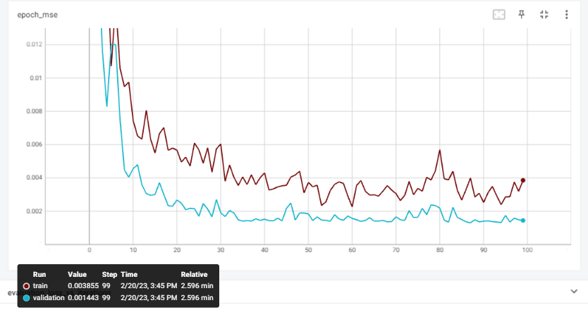

# Covid-19 Daily Cases Prediction in Malaysia

This project aims to forecast the number of Covid-19 daily cases in Malaysia. The daily cases data are obtained from the [Ministry of Health Malaysia's GitHub Repo](https://github.com/MoH-Malaysia/covid19-public).

## Build With:

  <a href="https://www.python.org" target="_blank" rel="noreferrer">    

## Directory Structure

1. [datasets](https://github.com/M-ImranIsmael/Deep_Learning_Applications/tree/master/covid_cases_prediction/datasets):

   - cases_malaysia_test.csv
   - cases_malaysia_train.csv

2. [training.py](https://github.com/M-ImranIsmael/Deep_Learning_Applications/blob/master/covid_cases_prediction/imran_training.py):

   - Importing necessary libraries
   - Loading and cleaning the data and EDA
   - Model selection and training using LSTM model
   - Model saving and testing on new datasets

3. [model_and_pickle](https://github.com/M-ImranIsmael/Deep_Learning_Applications/tree/master/covid_cases_prediction/model_and_pickle): trained deep learning model and pickle file for mms

4. [pictures](https://github.com/M-ImranIsmael/Deep_Learning_Applications/tree/master/covid_cases_prediction/pictures): plots and results

## Results

### Daily New COVID-19 Cases in Malaysia Plot

### LSTM Model Architecture

### Tensorboard Result

### Actual vs Predicted Covid-19 Cases

### Model Reports

## Acknowledgment of Data

The dataset used in this project was obtained from:
[Ministry of Health Malaysia's GitHub Repo](https://github.com/MoH-Malaysia/covid19-public).
