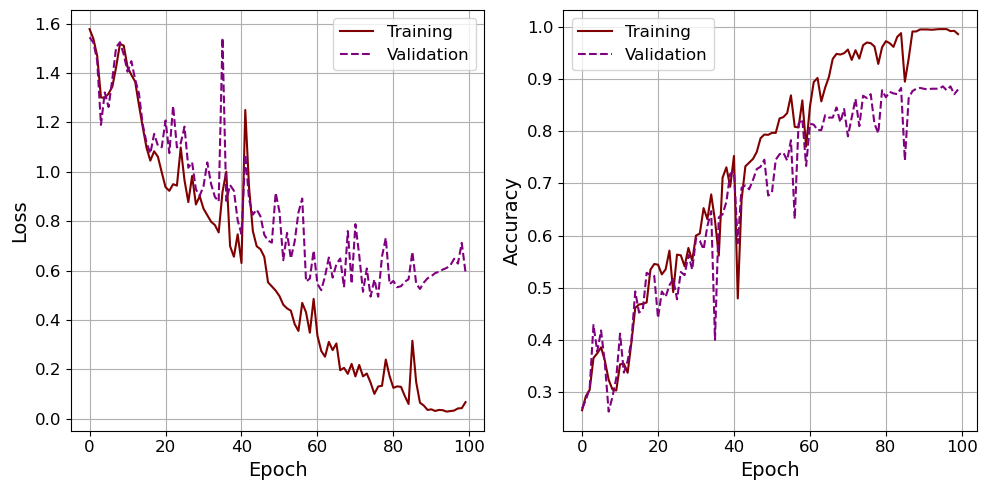

# Multiclass Text Classification (Articles)

This project aims to use deep learning models to automatically categorize articles based on their topics. It aims to predict whether an article belongs to one of five categories: sport, business, politics, tech, or entertainment. The goal is to create a model that can accurately classify articles and help automate the process of organizing and tagging content.

## Build With

  
  
  
  
  
  
  

## Directory Structure:

- training.py: This script contains the code for training the deep learning model. It includes loading and preprocessing the data, defining and compiling the model, and fitting the model to the training data.

- module.py: This module contains the functions used in the training script, including clean_text function that uses regular expressions to remove URLs, special characters, and numbers, model_lstm function that defines the architecture of the LSTM model, and plot_hist function that plots the training and validation accuracy and loss.

- main.py: This script deploys and tests the trained model with real-world articles. It loads the saved model and preprocessing objects, accepts user input, cleans and preprocesses the input, and uses the loaded model to make predictions on the input.

- pictures: This folder contains plots and results of the model, including the confusion matrix and training/validation accuracy and loss graphs.

- saved_models: This folder contains the saved trained model, one-hot-encoder (ohe.pkl) used to encode the target variable, and tokenizer (tokenizer.json) used to tokenize the input data.

# Results

## LSTM Model Architecture

The architecture consists of two LSTM layers with 64 units each, followed by a dropout layer to help prevent overfitting. The output of the second LSTM layer is then fed into a dense layer with a softmax activation function that produces 5 output values. The embedding layer at the beginning of the model converts the tokenized words into dense vectors of fixed size.

Here is a summary of the model architecture:

## Tensorboard Result

The two plots below show the training progress of the LSTM model using TensorBoard.

The first plot shows the epoch loss for both the training and validation datasets. The loss is calculated as the difference between the predicted and actual values for each time step, and the lower the loss, the better the model performs.

The second plot shows the epoch accuracy for both the training and validation datasets. Accuracy is a metric used to evaluate the performance of the model, and it measures the percentage of correct predictions made by the model. The higher the accuracy, the better the model performs.

## Training Process

The two plots below are the same as before exept it uses the matplotlib library.

## Classification Report

## Confusion Matrix

# Acknowledgment of Data 💕

The project is made possible with the dataset obtained from:

[susanli2016's GitHub Repo](https://github.com/susanli2016/PyCon-Canada-2019-NLP-Tutorial)

Thank you 💕
